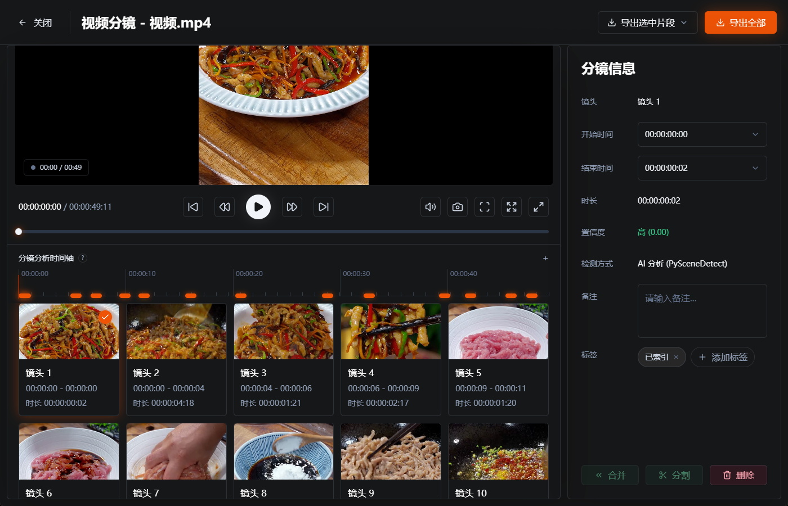

# ClipKnife

> Language: [中文](./README.md) | English


## What Is ClipKnife?

ClipKnife is a local-first desktop app for media asset management and AI visual search. It is built for video creators, designers, and content operators who need to find useful images and video moments inside large local asset libraries.

It is not mainly a video trimmer. Its core purpose is to help you find the right visual material from scattered folders, project directories, drives, and external disks.

In simple terms: add your asset folders to ClipKnife, let it scan and index them locally, then search your images and video clips with natural language queries such as "sunset by the sea", "red product close-up", or "person walking into an office".


## What It Does

ClipKnife turns multiple local folders into one searchable media library:

- Manage multiple material sources, including folders, drive roots, external disks, and project directories.
- Scan local assets and record file paths, source information, file type, status, and indexing progress.
- Watch for file changes so newly added, modified, or deleted assets can enter the background processing queue.
- Index images for text-to-image search through the local visual search service.
- Split videos into scenes or shots, extract representative frames with ffmpeg, index those frames, and link results back to the original video time range.
- Search with natural language in Chinese or English and return mixed image and video-clip results.
- Review video shots, adjust time ranges, edit tags and notes, merge, split, delete, and export selected clips.
- Inspect tasks, indexing status, health checks, repair actions, and diagnostic exports when local dependencies or material sources need attention.

  

## Use Cases

- Your assets are spread across many folders, projects, drives, or external disks, and filenames are no longer enough.
- You have long video files and need to search by shot or scene instead of by the whole video file.
- You want to find visuals by describing the image, such as "night aerial shot", "white background product photo", or "medium shot interview".
- You want the core scan, indexing, and search workflow to run locally instead of uploading original media files to the cloud.


## Core Workflow

1. Initialize the local runtime environment on first launch.
2. Add one or more material sources.
3. Run the initial library build to scan images and videos.
4. Images are sent directly to the local visual search index.
5. Videos are split into shots or scenes, then representative frames are extracted with ffmpeg.
6. Representative frames are indexed and linked to the original video path, shot ID, start time, and end time.
7. Search from the search page with a natural language query.
8. Open the original file, locate it in the file system, or continue working in the video detail view.


## Privacy and Data

ClipKnife's core asset processing runs locally. Source media files, indexes, scene results, frame caches, task state, and logs are managed around the local application workspace. Diagnostic and update-related features are intended to inspect software status and should not upload original user media files.



## Development Environment

The project currently targets Windows desktop packaging. Recommended environment:

- Node.js 22.22.0
- pnpm
- Bun
- Rust 1.88.0 or newer
- Python 3.11.9

Install root dependencies:

```powershell
pnpm install
```

Install Bun sidecar dependencies:

```powershell
cd bun
bun install
cd ..
```

## Local Development

Start the Tauri development environment:

```powershell
pnpm tauri dev
```

The Tauri dev command builds the Bun sidecar first, then starts the Vite frontend.

Build the frontend only:

```powershell
pnpm build
```

Build the Bun sidecar only:

```powershell
pnpm build:bun-sidecar
```

## Packaging

Run the Windows build script:

```powershell
.\build.ps1
```

The script checks the Rust version, installs root dependencies, builds the Bun sidecar, copies `ClipKnifeCore` into the Tauri binaries directory, and then runs the Tauri package build. Offline packages under `external` are optional large runtime dependencies used during local environment initialization. Place them beside the installer output when needed.

## Project Status

This repository is implementing the ClipKnife MVP: local environment initialization, material source management, full scans, incremental watching, image indexing, video shot indexing, unified natural language search, video detail workflows, task center, and diagnostics. The `project` and `toolbox` entries are currently reserved pages.
