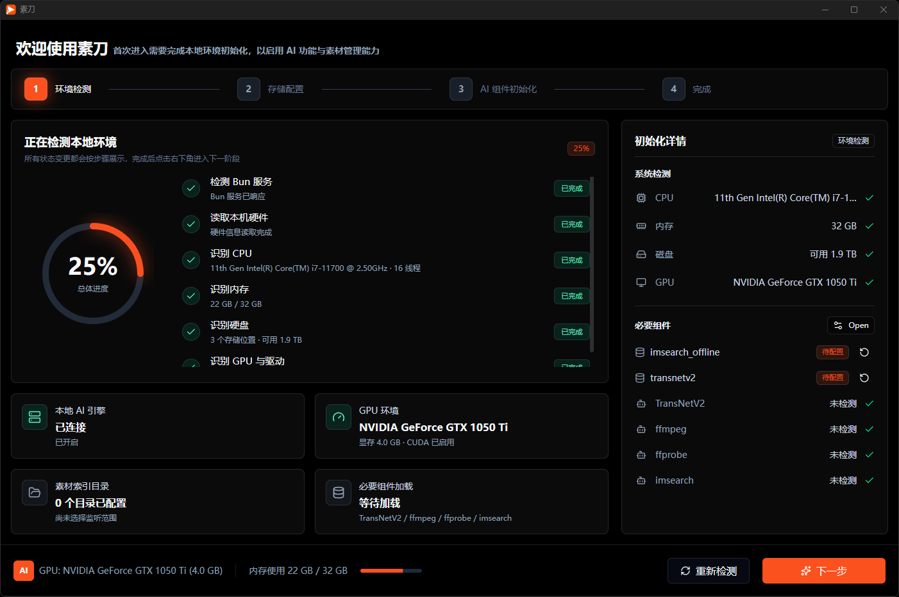
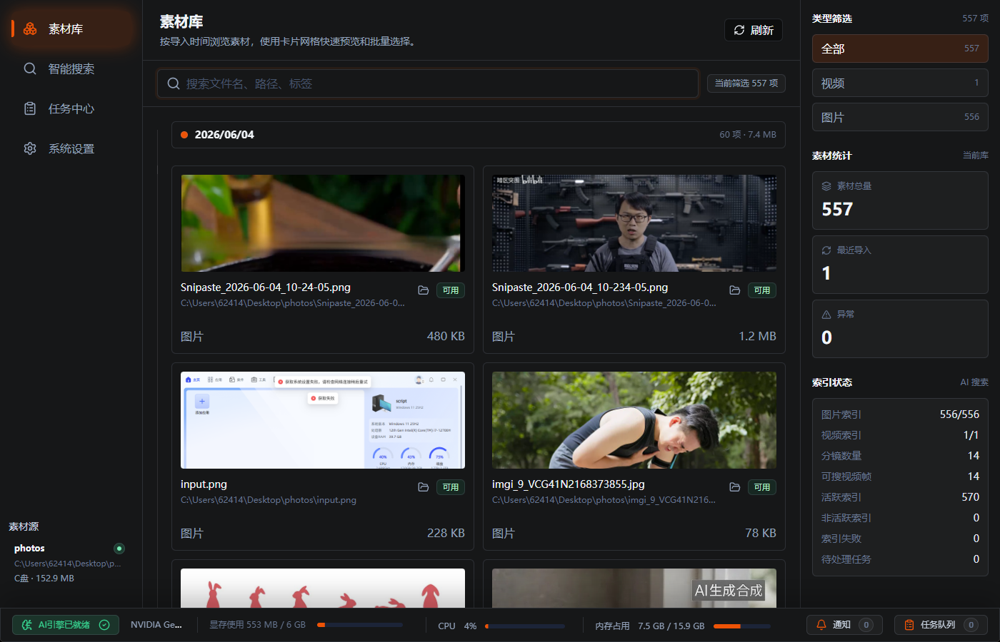
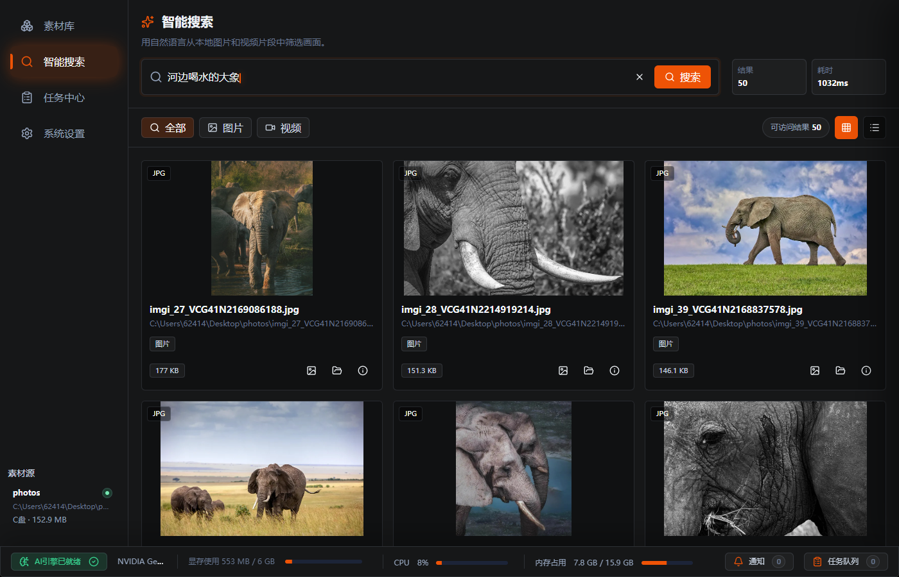

# 素刀（ClipKnife）

> 语言：中文 | [English](./README.en.md)


## 素刀是什么？

素刀是一款面向视频创作者、设计师和内容运营的本地素材管理与 AI 检索桌面软件。它要解决的问题不是“剪一段视频”，而是让你在大量散落的图片、视频和外接硬盘素材里，快速找到想要的画面。

简单说：把素材文件夹交给素刀，它会在本机扫描、建库、分镜和索引；之后你可以用一句自然语言搜索本地图片和视频片段，例如“海边日落”“红色包装特写”“有人走进办公室”。



## 它是干什么的

素刀会把多个本地素材目录整合成一个可搜索的素材库：

- 管理多个素材源：支持添加文件夹、盘符根目录、外接硬盘路径或项目目录。
- 自动扫描素材：识别图片和视频文件，记录路径、状态、来源和索引进度。
- 持续监听变化：素材新增、修改、删除后，通过后台任务队列进入增量处理流程。
- 图片 AI 索引：图片会直接写入本地视觉检索索引，用于以文搜图。
- 视频分镜索引：视频会先做镜头/场景切分，再用 ffmpeg 抽取代表帧，最后把代表帧写入检索索引，并关联回原视频的起止时间。
- 自然语言搜索：在统一搜索框输入中文或英文描述，返回图片和视频片段混合结果。
- 视频片段处理：可以查看分镜，调整片段时间，编辑标签和备注，合并、拆分、删除分镜，并导出选中片段或全部片段。
- 任务和诊断：提供任务中心、索引状态、健康检查、修复动作和诊断导出，方便定位本地依赖或素材源问题。


## 适合的使用场景

- 素材分散在多个硬盘、文件夹和项目目录里，靠文件名已经找不到。
- 视频素材很长，需要按镜头片段检索，而不是只按整个文件检索。
- 希望用“画面描述”找素材，比如“夜景航拍”“白色背景产品图”“人物采访中景”。
- 不想先把素材上传到云端，希望核心扫描、索引和搜索都在本机完成。



## 核心工作流

1. 首次启动后初始化本地运行环境。
2. 添加一个或多个素材源。
3. 执行首次建库，扫描图片和视频。
4. 图片直接进入 imsearch 视觉索引。
5. 视频经过分镜，再由 ffmpeg 抽取代表帧。
6. 代表帧进入 imsearch 索引，并保留原视频路径、分镜 ID、开始时间和结束时间。
7. 用户通过搜索页输入自然语言，找到图片或视频片段。
8. 点击结果后打开原始文件、定位文件目录，或进入视频片段详情继续处理。




## 隐私与数据

素刀的核心素材处理在本机完成。素材文件、索引、分镜结果、代表帧缓存、任务状态和日志都围绕本地应用目录工作。诊断和更新相关能力用于检查软件运行状态，不应上传用户原始素材文件。

## 开发环境

当前项目主要面向 Windows 桌面端打包。建议环境：

- Node.js 22.22.0
- pnpm
- Bun
- Rust 1.88.0 或更新版本
- Python 3.11.9

安装根目录依赖：

```powershell
pnpm install
```

安装 Bun sidecar 依赖：

```powershell
cd bun
bun install
cd ..
```

## 本地开发

启动 Tauri 开发环境：

```powershell
pnpm tauri dev
```

Tauri 的开发命令会先构建 Bun sidecar，再启动 Vite 前端。

也可以单独构建前端：

```powershell
pnpm build
```

单独构建 Bun sidecar：

```powershell
pnpm build:bun-sidecar
```

## 打包

Windows 一键构建：

```powershell
.\build.ps1
```

脚本会检查 Rust 版本，安装根目录依赖，构建 Bun sidecar，把 `ClipKnifeCore` 复制到 Tauri binaries 目录，然后执行 Tauri 打包。`external` 下的离线包是运行环境初始化所需的可选大体积依赖，发布时按需要放到安装包输出目录旁。

## 项目状态

这个仓库正在实现素刀的 MVP：本地环境初始化、素材源管理、全量扫描、增量监听、图片索引、视频分镜索引、统一自然语言搜索、视频片段详情、任务中心和诊断维护。`project`、`toolbox` 等入口目前是预留页面。
