# ClipKnife 使用手册

更新时间：2026-08-18

ClipKnife（素刀）是一款本地素材管理与智能检索工具。你可以把分散在文件夹、盘符和外接硬盘里的图片、视频、音频素材加入素材库，再通过自然语言搜索、视频分镜、代表帧和语音转写快速找回可用素材。

本手册按真实使用流程编写。涉及截图的位置已经标出文件名，你可以后续把图片放到对应目录。

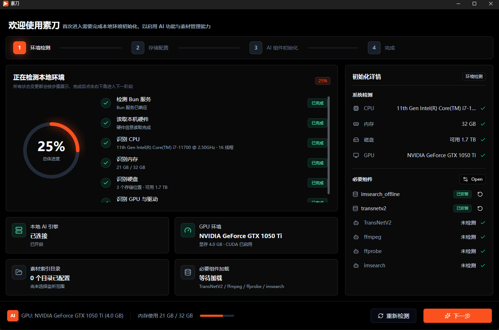

## 1. 开始前先了解几个概念

### 素材源

素材源是 ClipKnife 扫描和监听的本地范围，可以是文件夹、整个盘符或外接硬盘路径。一个素材源不可访问时，ClipKnife 会提示异常，但不会影响其他可用素材源继续工作。

### 素材库

素材库是多个素材源汇总后的统一空间。你在素材库看到的是所有已入库素材，而不是某一个目录。当前支持图片、视频和音频。

### AI 索引

AI 索引让素材可以被自然语言搜索。图片会进入视觉检索索引；视频会先分镜，再抽取代表帧进入视觉检索索引；音频会转写成文本后进入语音检索索引；开启视频语音转写后，视频中的语音内容也可以被搜索。

### 分镜

分镜是视频被自动切分后的片段。每个分镜包含起止时间、代表帧、状态和可编辑信息。分镜可以被搜索、预览、标注、加入项目和导出。

### 项目

项目用于临时组织素材和分镜。你可以把素材或分镜加入项目，再从项目中拖拽到外部创作软件或导入区。移除项目条目不会删除原始素材文件。

## 2. 首次启动与初始化

第一次打开 ClipKnife 时，应用会检查本地初始化状态。如果状态还不是 ready，会进入初始化流程。

初始化会完成三件事：

- 选择素材监听范围。
- 配置素材索引目录。
- 初始化本地 AI 组件和必要运行状态。

建议按下面顺序操作：

1. 打开 ClipKnife。
2. 在初始化页面添加第一个素材源，可以选择素材文件夹、盘符或外接硬盘路径。
3. 确认索引目录，保留默认位置即可，除非你希望把索引放到空间更大的磁盘。
4. 等待本地 AI 组件初始化完成。
5. 初始化成功后进入主工作台。

注意：初始化期间关闭窗口可能中断流程。若页面提示可以最小化到托盘，优先使用最小化而不是直接退出。

## 3. 添加和管理素材源

素材源管理用于告诉 ClipKnife 去哪里扫描素材。

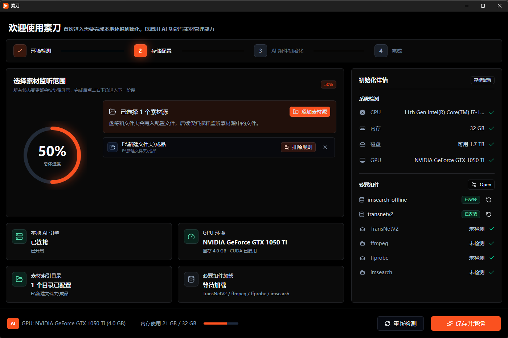

你可以从这些入口进入素材源管理：

- 首次初始化流程。
- 素材库空状态。
- 系统设置中的素材源管理。
- 其他引导入口。

添加素材源时，ClipKnife 会做预检：

- 路径是否存在。
- 路径是否可访问。
- 是否与已有素材源重复。
- 是否与已有素材源存在父子路径重叠。
- 是否是盘符或外接盘等扫描范围较大的路径。

如果预检发现风险但仍可继续，ClipKnife 会要求你确认。比如添加整个盘符时，建议先确认排除规则，避免扫描系统目录、缓存目录、开发依赖目录和 ClipKnife 自身工作目录。

素材源列表会展示访问状态、扫描状态、监听状态和最近更新时间。你可以启用、停用或移除素材源。移除素材源只会移除 ClipKnife 对该路径的管理，不会删除原始文件。

## 4. 建库、监听和后台任务

添加素材源后，可以启动初始建库。初始建库会扫描已启用素材源，把支持的图片、视频和音频加入素材库，并创建后续索引任务。

监听用于捕获后续变化。当素材源里新增、修改或删除文件时，ClipKnife 会把变化加入后台任务队列，避免素材库长期与本地文件不一致。

建库和索引可能需要时间，尤其是素材较多、视频较长或开启语音转写时。你可以在任务中心查看进度和失败原因。

## 5. 浏览素材库

素材库是浏览、筛选、预览和进入详情的主入口。

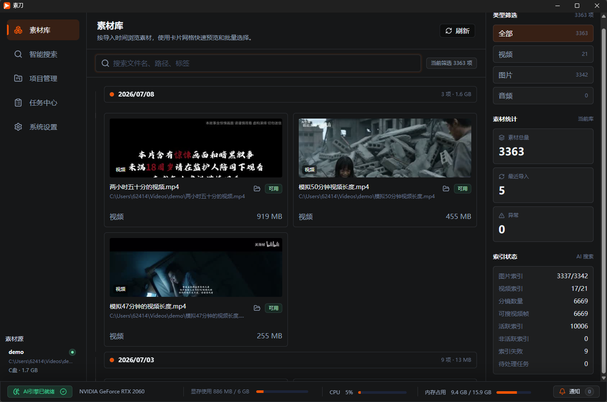

素材库通常会展示：

- 素材总量。
- 图片、视频、音频数量。
- AI 索引相关统计，例如已索引、待处理和失败数量。
- 素材卡片网格。

你可以在素材库中搜索文件名、路径和标签，也可以按素材类型筛选。这里的搜索主要基于素材元信息，不等同于智能搜索。

素材卡片常见操作包括：

- 选择素材。
- 打开原文件。
- 打开所在目录。
- 查看详情。
- 预览图片、视频或音频。

素材详情会展示文件基础信息、路径、索引状态和处理结果。图片详情关注图片索引状态；视频详情会展示分镜数量和已索引帧数量；音频详情会展示转写内容和索引状态。

## 6. 使用智能搜索

智能搜索让你用自然语言找本地素材。你不需要理解模型、索引或分镜流程，只需要输入画面或语音内容描述。

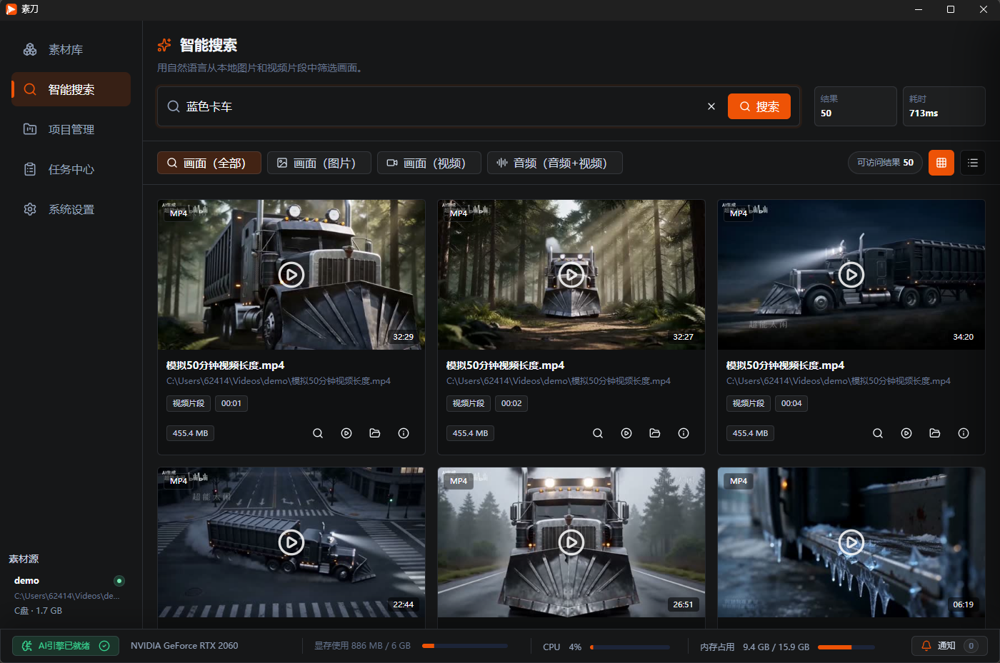

智能搜索支持以下模式：

- 全部：混合返回图片、视频片段和音频结果。
- 图片：搜索图片素材。
- 视频：搜索视频分镜代表帧或视频语音片段。
- 音频：搜索音频素材和视频语音内容。

可以输入中文或英文描述，例如：

- 海边日落。
- 红色包装特写。
- 一群人在河边喝水的大象。
- 会议里提到预算调整。

搜索结果会展示缩略图或媒体预览、文件名、路径、匹配类型、相似度或相关性信息。视频结果会显示片段起止时间；音频和视频语音结果会显示转写文本。

如果搜索没有结果，可以检查：

- 是否输入了明确描述。
- 素材是否已经完成索引。
- 当前搜索模式是否过窄。
- 素材源是否断开或文件是否被移动。
- 搜索服务是否可用。

## 7. 使用以图搜图

图片结果和视频代表帧结果可以作为相似检索入口。你可以从当前结果触发以图搜图，查找视觉上相近的素材。

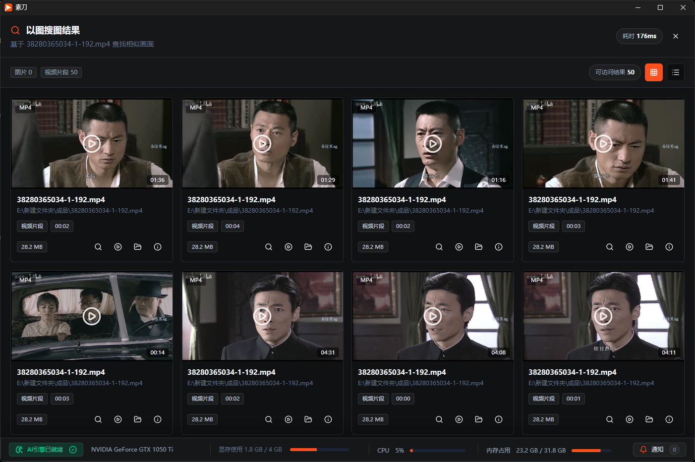

如果结果缺少可用的相似检索索引 ID，ClipKnife 会提示需要重新构建 AI 索引。此时可以先查看任务中心或诊断入口，确认相关索引是否失败或失效。

## 8. 视频详情与分镜

从素材库或智能搜索的视频结果可以进入视频详情页。这里用于播放视频、查看分镜、编辑片段信息和导出片段。

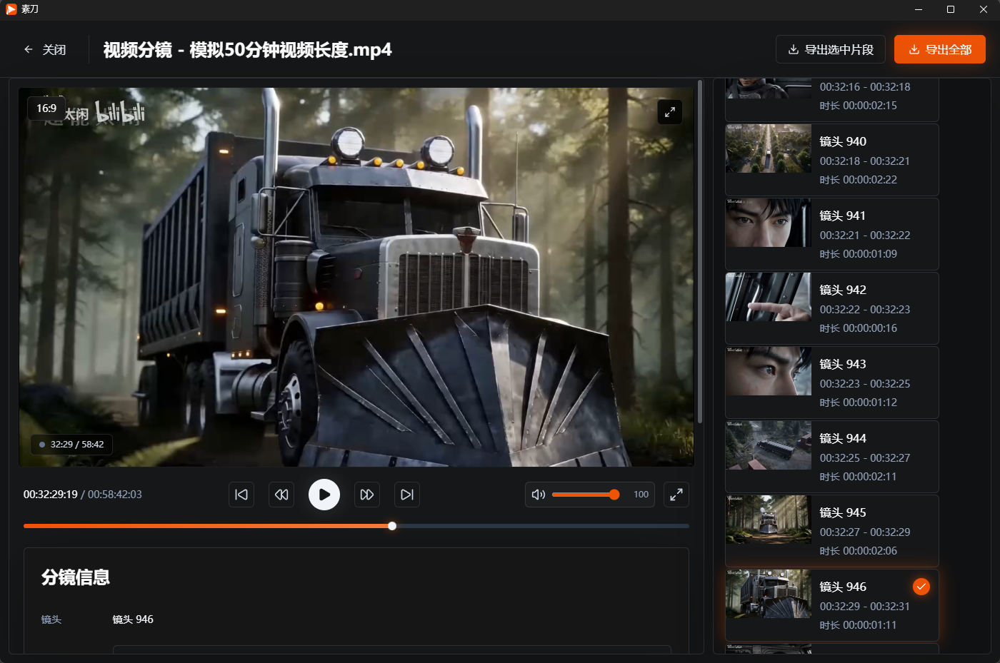

视频详情通常包含：

- 视频预览播放器。
- 分镜列表。
- 当前分镜起止时间。
- 分镜代表帧。
- 备注、标签和转写文本。
- 导出入口。

你可以对分镜执行这些操作：

- 调整起止时间。
- 更新备注和标签。
- 合并分镜。
- 分割分镜。
- 删除分镜。

这些操作作用于 ClipKnife 的分镜记录和项目工作流，不会直接破坏原始视频文件。

导出片段时，可以导出选中片段，也可以导出全部片段。导出会创建后台任务，并把结果写入指定输出目录。导出成功后，你会看到导出路径。

## 9. 音频与语音检索

ClipKnife 支持把音频作为素材库的一类资源。音频素材可以播放、查看详情，并通过语音转写参与搜索。

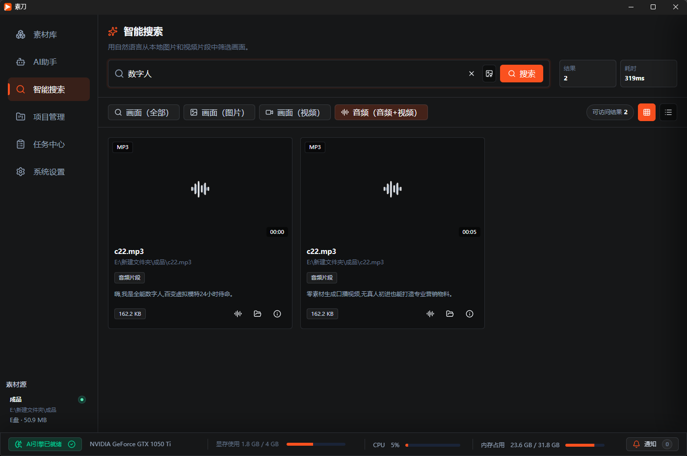

音频素材始终会生成可搜索转写。视频语音转写由系统设置控制，开启后 ClipKnife 会为视频素材补建或新增语音转写任务。

语音搜索基于转写文本。你可以搜索音频中的语音内容，也可以在开启视频语音转写后搜索视频中的语音内容。视频语音片段仍保留视频身份，方便你回到视频上下文。

## 10. 项目管理

项目用于把分散找到的素材或分镜组织成可拖拽的工作集合，适合剪辑、设计和素材整理流程。

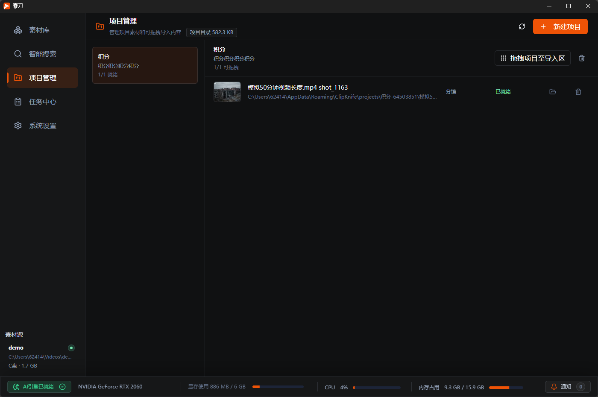

使用项目的一般流程：

1. 创建项目，填写项目名称和描述。
2. 从素材库、搜索结果或视频详情把素材加入项目。
3. 在项目详情中查看素材和分镜条目。
4. 将项目内容拖拽到外部创作软件或导入区。

项目条目会显示类型和状态，例如素材、分镜、就绪、处理中或失败。只有已就绪的项目条目会进入拖拽载荷，缺失或未就绪条目会被跳过。

删除项目会删除项目记录和项目文件夹中的导出内容，操作不可撤销。从项目中移除素材只影响当前项目，不会删除原始素材文件。

## 11. 让创作助手根据反馈修正 Skill

创作助手设置中的“技能”页面管理素刀私有的本地 Skills。你可以创建、编辑、启用或停用 Skill；自定义 Skill 可以删除，内置 Skill 可以修改但不能删除。这里不会读取系统或其他 Agent 的全局 Skills。

如果希望某条反馈不只用于当前任务，而是成为后续创作习惯，请明确说明长期意图，例如“以后产品短片开头先给结论，请记住并修正你的流程”。创作助手会：

1. 找到并完整读取当前已启用、与反馈最相关的 Skill。
2. 只对 Skill 正文提出一处最小、精确的修改，不改变 Skill 名称和用途。
3. 在界面中展示修改原因、原文和新文摘要。
4. 等待你确认后写入本地 `SKILL.md`；拒绝确认则不会修改。

等待确认期间如果你又从设置中编辑了同一个 Skill，助手会取消旧修改，避免覆盖较新的内容。普通的本轮返工不会自动变成长期规则；一次性项目内容、素材路径、隐私数据和密钥也不应写入 Skill。完成后可以回到“技能”页面查看“已修改”状态、继续手工编辑，或将内置 Skill 恢复为官方版本。

## 12. 工具箱与文本转语音

工具箱以卡片列表展示素刀已经适配的创作工具。当前首个工具是“文本转语音”。首次使用前，先在左侧导航打开“工具箱”，在工具卡片上点击“安装工具”；未安装时不能进入工具详情。安装完成后，卡片会显示“进入工具”，有新版本时同一位置也会显示更新入口。下载、校验和解压过程会显示进度，也可以在任务中心查看。

安装完成后：

1. 从工具卡片进入“文本转语音”详情，在“文本内容”中输入旁白、解说或对白，单次最多 50,000 个字符。
2. 从本机工具实时返回的音色列表中选择音色，并填写便于识别的文件名。
3. 点击“生成语音”。长文本会自动分段，完成后合并为一个 WAV 文件。
4. 在“最近生成”中试听文件，或点击“在文件夹中显示”定位结果。

创作助手也可以调用这个工具。安装工具后，发送消息前可以在对话输入区打开“音色”弹窗，从当前音色列表中选择，并按名称、语言或音色标识筛选；没有安装文本转语音工具时不会显示该入口。素刀会记住确认的选择，下次新建对话时默认继续使用。如果上次音色已经不在当前列表中，则自动改用列表中的第一个音色。它生成的 WAV 文件会直接保存在当前会话工作区，不会进入工具箱输出目录或“最近生成”列表。当前会话已经选择草稿时，创作助手默认把生成结果加入从 0 秒开始的独立“AI配音”音频轨道；如果你明确要求只生成文件，则不会修改草稿。即使导入草稿失败，已经生成的 WAV 文件也会保留。

工具类型和界面由客户端预先提供，服务端记录的是版本和下载地址，不会通过服务端数据动态出现未经客户端适配的新工具。输入正文不会写入本地数据库或任务记录。

## 13. 任务中心

任务中心用于观察后台任务状态、定位失败素材，并执行重试或恢复操作。

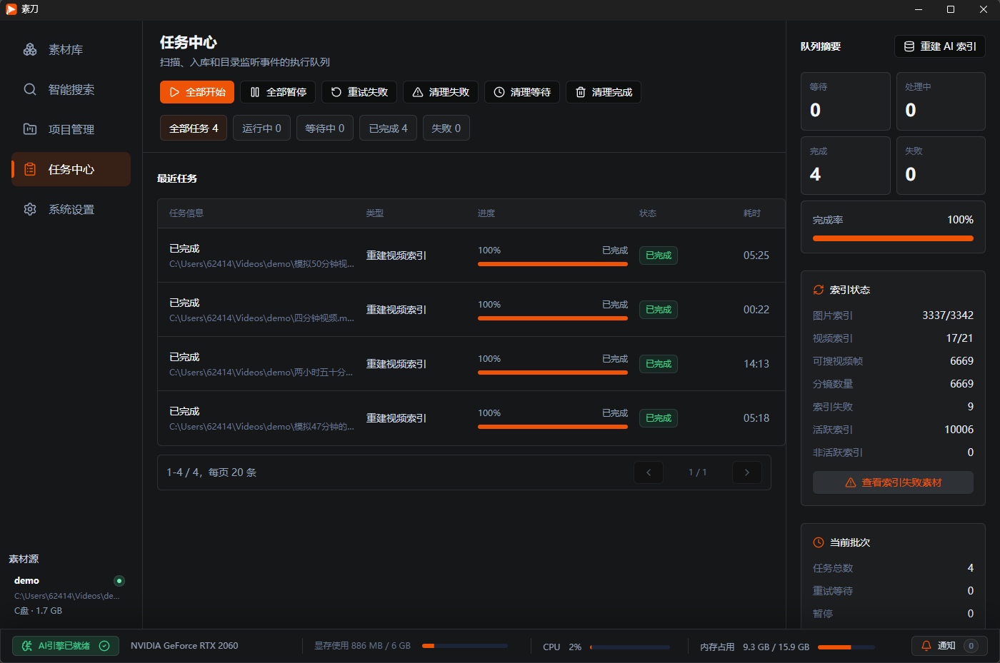

任务中心覆盖这些类型：

- 扫描素材源。
- 发现素材。
- 素材入库。
- 重扫素材源。
- 重试索引失败任务。
- 重建语音索引。
- 删除语音索引。

你可以按状态筛选任务，例如全部、等待、处理中、完成和失败。对于失败素材，可以查看文件、类型和失败原因，再根据情况修复源文件、恢复外接盘、重试任务或重新建库。

没有任务时，任务中心会提示：启动素材扫描后，扫描和入库任务会显示在这里。

## 14. 系统设置

系统设置用于管理本地运行环境、素材源和全局配置。

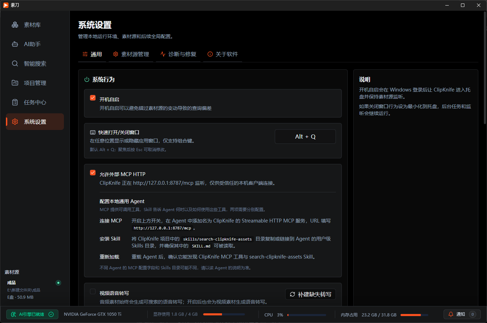

常规设置包括：

- 开机自启：Windows 登录后让 ClipKnife 进入托盘并保持素材源监听。
- 关闭窗口行为：每次询问、最小化到托盘或直接退出。
- 视频语音转写：控制是否为视频素材生成可搜索语音转写。
- 补建缺失转写：为缺失语音转写的素材创建后台任务。

AI 与媒体组件设置会展示 TransNetV2、ffmpeg/ffprobe、imsearch 和语音转写组件等本地能力。它们的状态会影响分镜、抽帧、视觉检索、相似检索和语音检索是否可用。组件管理会同时展示 imsearch 与 TransNetV2 的当前版本、运行版本和当前软件版本的配套版本。

如果 imsearch 或 TransNetV2 与当前软件版本的配套版本不一致，组件管理会给出版本不匹配提示和软件网盘入口。请从软件网盘下载配套的组件压缩包，再回到组件管理选择压缩包并确认替换；应用不会静默自动安装组件包。

系统设置还包含素材源管理、诊断与修复、系统更新、通知和关于等入口。

## 15. 诊断与修复

诊断用于检查本地环境、素材源、任务队列、索引和搜索服务是否可用。

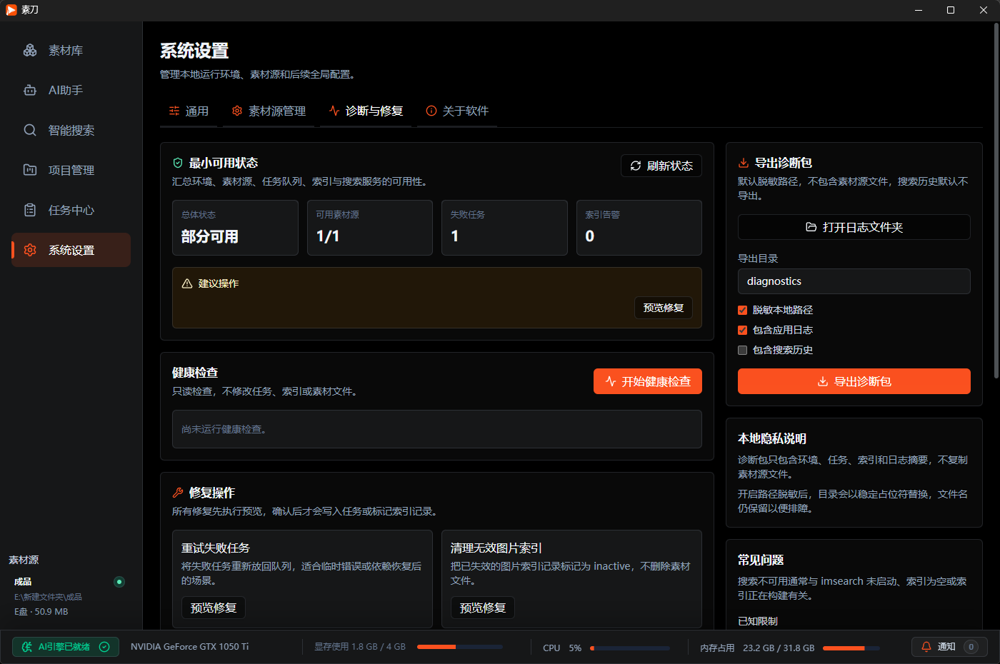

你可以先执行只读健康检查。只读检查不会修改任务、索引或素材文件。

修复操作会先执行预览，确认后才写入任务或标记索引记录。常见修复包括：

- 重试失败任务。
- 清理失效图片索引。
- 清理失效视频索引。
- 压缩搜索索引。
- 重启搜索服务。

导出诊断包用于问题排查。诊断包默认脱敏路径，不包含素材源文件，搜索历史默认不导出。

## 16. 更新、通知和关于

系统设置提供检查更新入口。ClipKnife 可以检查 stable 发布渠道中的最新版本，并区分全量安装包和增量更新包。存在可用更新时，你可以查看更新说明、更新包类型、全量更新阈值，并下载更新。

如果当前版本落后多个已发布版本，更新提示会按版本从新到旧列出期间所有更新说明，避免遗漏中间版本内容。

检查更新还会比较本机 imsearch、TransNetV2 与最新发布记录中的对应组件版本。组件版本落后时，即使主程序已是最新版，也会显示组件更新提示和软件网盘入口。

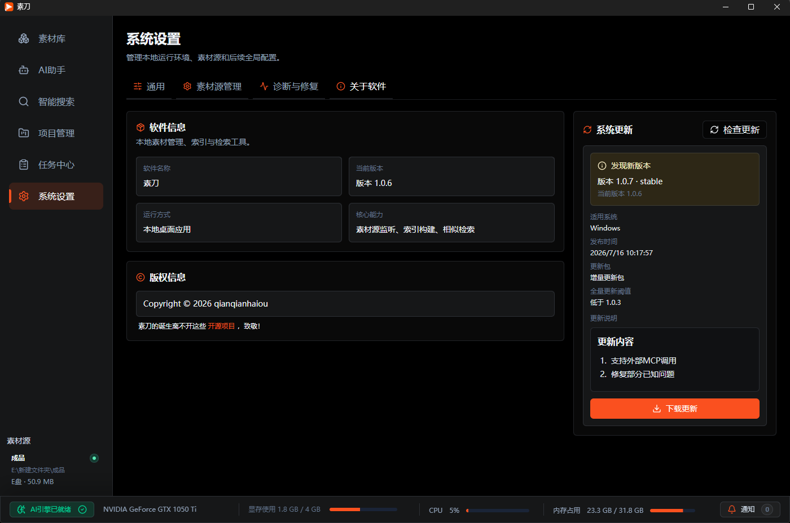

通知入口用于展示来自远程服务的通知。通知可以刷新、标记已读，并展示未读数量。通知类型包括信息、警告和更新提示。

关于页展示产品名称、版本、核心能力描述和开源项目致谢。

## 17. 隐私与本地文件边界

ClipKnife 是本地优先产品。素材扫描、索引、搜索、分镜和转写的核心工作以本地环境为主。

请记住这些边界：

- 移除素材源不会删除原始文件。
- 从项目中移除素材不会删除原始文件。
- 视频分镜编辑不会直接破坏原始视频文件。
- 诊断包默认脱敏路径，不复制用户素材源文件。
- 搜索历史默认不导出。
- 外接盘断开或路径失效时，ClipKnife 会提示异常，但不应影响其他素材源。

远程服务只用于辅助能力，例如检查更新、拉取通知和标记通知已读，不承担本地素材内容处理职责。

## 18. 已知限制

当前产品边界包括：

- 不包含账号系统。
- 不包含云同步。
- 不包含多人协作。
- 不包含在线素材市场。
- 不包含商业化付费逻辑。
- 不承诺自动理解完整视频语义，视频视觉检索主要基于分镜代表帧。
- 搜索结果依赖本地索引质量，索引未完成或失败会影响可搜索范围。
- 搜索服务不可用、模型组件缺失或外接盘断开时，相关能力会降级或提示错误。

## 19. 建议的日常使用方式

- 素材源尽量选择稳定路径，外接盘使用固定盘符会更容易维护。
- 添加整盘符前确认排除规则，避免误扫系统目录或缓存目录。
- 大批量导入后先等待索引任务完成，再进行智能搜索。
- 搜索无结果时，先换一个更具体的描述，再检查任务中心。
- 处理失败素材时，优先确认源文件是否存在、外接盘是否连接、索引服务是否可用。
- 对重要项目，导出片段后再进入后续剪辑流程。
